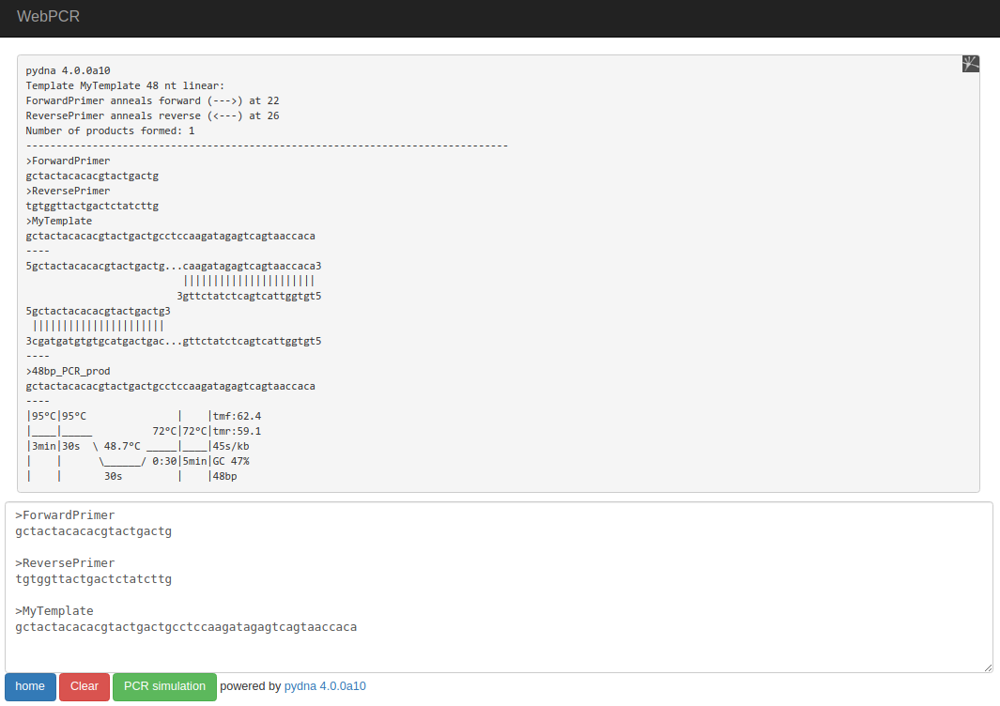
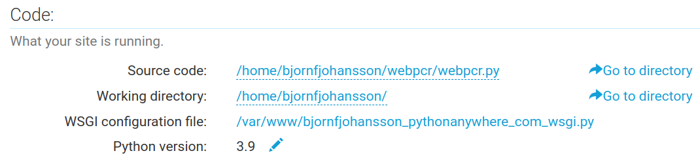
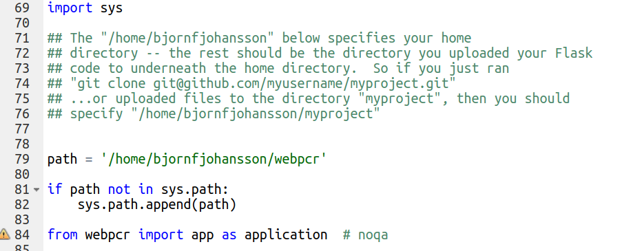

# webpcr

This is a flask app that contains a PCR simulator and a Tm calculator.
It is built on top of [pydna](https://github.com/BjornFJohansson/pydna).

It is available [here](http://bjornfjohansson.pythonanywhere.com/#).

https://bit.ly/pydnawebpcr

Installed on [pythonanywhere](https://www.pythonanywhere.com) like this:

	mkvirtualenv --python=/usr/bin/python3.9 my-virtualenv
	pip install flask flask-wtf wtforms
	pip install pydna==4.0.0a10
	git clone https://github.com/BjornFJohansson/webpcr.git

