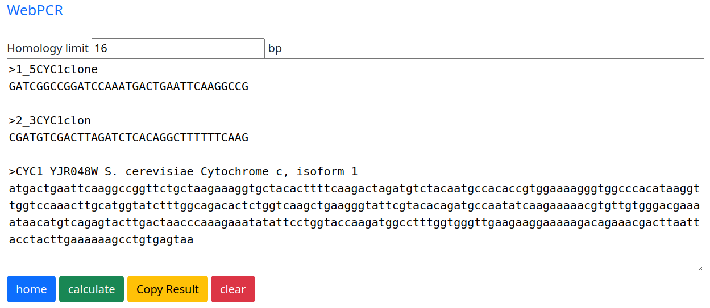
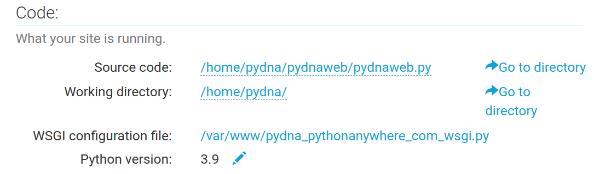
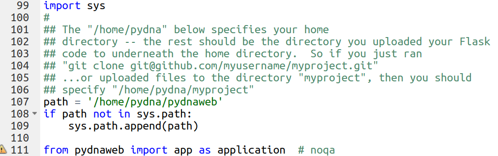

# pydnaweb

A flask app that make selected [pydna](https://github.com/BjornFJohansson/pydna) functionality available as a [web service](http://pydna.pythonanywhere.com/#).

- The WebPCR simulator.
- Primer Tm calculator based on The [Bio.SeqUtils.MeltingTemp](https://biopython.org/docs/1.81/api/Bio.SeqUtils.MeltingTemp.html) module.
- Primer designer. Design two flanking primers, given a template sequence.
- Assembly primer designer. Design tailed primers for assembly by HR.
- Assembly simulator. Assemble a series of sequences by shared homology.

[blogpost](https://ochsavidare.blogspot.com/2013/12/webpcr-pcr-product-simulation.html)

Installed on [pythonanywhere](https://www.pythonanywhere.com) like this:

	mkvirtualenv --python=/usr/bin/python3.9 my-virtualenv
	pip install --upgrade flask flask-wtf wtforms pydna
	git clone https://github.com/BjornFJohansson/pydnaweb.git

Settings uder the "Web" tab in python anywhere:

Settings in the `/var/www/pydna_pythonanywhere_com_wsgi.py` file:

